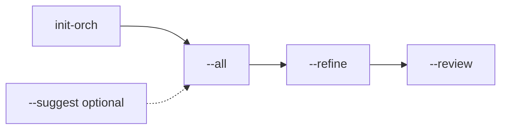

# init-orch

`init-orch` is a small compiler for repo-local agent setup.

It helps you go from zero to a usable Cursor/Claude setup quickly, then improve it later without hand-maintaining `.cursor/`, `.claude/`, `AGENTS.md`, and related files separately.

Project's name on [Osvaldo Zubeldía](https://es.wikipedia.org/wiki/Osvaldo_Zubeld%C3%ADa), former DT Estudiantes de La Plata, world-champion 1968.

Instead of hand-editing `.cursor/`, `.claude/`, `AGENTS.md`, and related config files, you describe the workflow once in `init-orch.md` and generate the target-specific files from that blueprint.

## 101

The minimal first-run path is:

```bash
init-orch
init-orch --all
```

That is the default path to a usable setup. Expect roughly:

- 2-5 minutes to bootstrap `init-orch.md` and render the first Cursor/Claude files
- 10-20 minutes if you also want to use `--suggest` and `--refine` for a more repo-native setup

If you only remember one thing, remember this:

- start with `init-orch`
- get to a first render with `init-orch --all`
- use `--suggest`, `--refine`, `--review`, and `--parity` only when they solve a real problem for the repo

## When To Use What

| Command                             | Use it when                                               | What it does                                                                         |
| ----------------------------------- | --------------------------------------------------------- | ------------------------------------------------------------------------------------ |
| `init-orch`                         | You are starting from scratch                             | Creates the first draft of `init-orch.md`                                            |
| `init-orch --list-presets`          | You want to compare preset options quickly                | Lists workflows, domains, composed presets, and recommended defaults                 |
| `init-orch --explain-preset <name>` | You want to understand one preset before choosing it      | Explains the preset's working-style bias, repo-shape bias, and default emphasis      |
| `init-orch --suggest`               | You want a better first ansatz                            | Proposes repo-aware updates for summary, mission, success criteria, and verification |
| `init-orch --all`                   | You are ready to compile the setup                        | Generates the tool-specific files from `init-orch.md`                                |
| `init-orch --all --dry-run`         | You want to review generated changes before writing       | Previews which generated files would be created or updated                           |
| `init-orch --refine`                | The first render exists and you want repo-specific detail | Adds checks, sensitive paths, and conventions back into the spec                     |
| `init-orch --review`                | The setup feels stale or off                              | Prints practical recommendations without rewriting files                             |
| `init-orch --parity`                | You want to inspect Cursor/Claude alignment directly      | Explains what is shared vs target-specific and surfaces parity drift                 |

## Workflow Diagram



## Mental Model

`init-orch.md` is the only high-level file you edit directly.

Everything else is generated from it:

- `AGENTS.md`
- `orch/*`
- `.cursor/*`
- `.claude/*`

That is the core product promise: one editable blueprint, many generated outputs, deliberate maintenance over time.

## The Product Loop

### Bootstrap

Run `init-orch` in a new repository and it can guide you through a short interactive setup:

```bash
init-orch
```

The bootstrap flow is intentionally small. It asks only for:

- a `workflow-domain` preset
- a short project summary
- target platforms
- a risk posture

It then creates a ready-to-edit `init-orch.md`. In the common case, you can render immediately with:

```bash
init-orch --all
```

If you already know what you want, you can skip the prompts and bootstrap directly:

```bash
init-orch --preset engineering-web-app --no-interactive
```

The preset is only the starting point. After bootstrap, edit `init-orch.md` to override any default.

### Compile

`init-orch.md` is the canonical source of truth. Edit that file, then compile the target-specific outputs:

```bash
init-orch --all
```

That generates:

- `AGENTS.md`
- `orch/permissions.policy.json`
- `orch/imports.lock.json`
- `orch/evaluation.plan.json`
- `.cursor/` rules, skills, imports, and MCP config
- `.claude/` settings, rules, agents, skills, and imports

The compile step is the strongest idea in the project: one high-level spec, many generated outputs, explicit review before changing the setup.

If you want a review-first workflow, preview the render plan before writing files:

```bash
init-orch --all --dry-run
```

If `init-orch` detects existing owned-looking structure such as `orch/`, `.cursor/`, `.claude/`, `AGENTS.md`, or an existing `.gitignore` line update, it will stop and ask for confirmation in a terminal. In non-interactive runs, re-run with:

```bash
init-orch --all --confirm-existing
```

### Suggest

If you want a better first ansatz before or after the first render, ask for a repo-aware proposal:

```bash
init-orch --suggest
```

This samples a bounded amount of repo evidence, prioritizes existing orchestration artifacts such as `init-orch.md`, `AGENTS.md`, `.cursor/`, `.claude/`, and `orch/`, and then proposes updates for `project.summary`, `project.mission`, `project.successCriteria`, and `verification`. For verification it now prefers real repo checks from scripts, CI, and language-specific config over weaker generic fallbacks, and keeps docs-oriented checks separate from code-oriented checks. The report now also explains why each recommendation was made, groups evidence into identity/workflow/verification/safety buckets, and asks targeted questions when confidence is low instead of guessing aggressively. It prints the proposal first and only applies it if you confirm.

### Refine

After the first render, tailor the setup to the real repository:

```bash
init-orch --refine
```

This asks for a short second pass of repo-specific details such as the most important verification command, sensitive paths, and existing conventions. The goal is to keep bootstrap minimal while still making the setup feel native to the repo.

When refine notes already exist, `init-orch --refine` now keeps them by default and only re-asks those fields if you choose to update them.

### Review

When the setup feels stale or off, ask for a deliberate review:

```bash
init-orch --review
```

This prints a short snapshot, top immediate actions, and practical setup recommendations without rewriting files. It now also tries to surface repo-specific issues such as path collisions, missing canonical verification commands, and workspace-style structure, while suppressing unchanged setup recommendations that have already been recorded. The goal is not an always-on orchestration brain. The goal is a lightweight review loop that helps you tighten the setup when it matters.

### Parity

If you want to inspect the cross-target value directly, run:

```bash
init-orch --parity
```

This explains what is shared between Cursor and Claude, what each target gets specifically, which target-specific overrides exist, and whether drift has appeared because one target was rendered more recently than the other.

## Why Use It

This is aimed at solo coders and small independent setups, not enterprise governance.

It is useful when you want to:

- get from zero to a decent multi-agent setup in a few minutes
- keep Cursor and Claude aligned without duplicating effort
- keep permissions, roles, and verification expectations explicit
- improve the setup over time without rebuilding it from scratch
- carry the same orchestration intent from project to project

The practical promise is portability of intent, not perfect invariance across every future platform.

## Presets

Presets use `workflow-domain` form, for example:

- `research-docs`
- `engineering-web-app`
- `poc-data-science`

Think of a preset as a first draft, not a lock-in. It pre-fills defaults for workflow bias, verification, safety posture, `responseStyle`, and generated guidance. You can then change any field in `init-orch.md`.

If you want help choosing before you commit, use:

```bash
init-orch --list-presets
init-orch --explain-preset engineering-web-app
```

The workflow controls the working style. The domain controls the repo-shape bias.

Available workflows:

| Workflow      | Best For                                                         | Bias                                                   |
| ------------- | ---------------------------------------------------------------- | ------------------------------------------------------ |
| `research`    | Exploratory work, synthesis, and careful source-driven iteration | Stronger evidence discipline, less production pressure |
| `engineering` | Maintainable long-term delivery                                  | Balanced default, stronger production-readiness        |
| `poc`         | Fast experiments and idea validation                             | Lighter process, faster iteration                      |

Available domains:

| Domain         | Best For                                                    | Bias                                           |
| -------------- | ----------------------------------------------------------- | ---------------------------------------------- |
| `generic`      | Libraries, APIs, backends, CLIs, and general software repos | Broad default                                  |
| `web-app`      | Frontend or full-stack apps with UI work                    | Stronger UI and behavior verification          |
| `data-science` | Notebooks, experiments, and models                          | Stronger reproducibility and experiment review |
| `infra`        | Infrastructure, automation, and ops work                    | Stricter safety and approval defaults          |
| `docs`         | Documentation-first repositories                            | Stronger editorial review                      |
| `multimedia`   | Asset-heavy or multimodal workflows                         | Stronger review and provenance awareness       |

The default preset is `engineering-generic`.

`project.riskPosture` stays separate from the preset so you can tune how cautious the setup should be.

`responseStyle` is preset-aware by default, so `research-*`, `engineering-*`, `docs-*`, and other preset families start with meaningfully different response behavior. It still stays fully editable in `init-orch.md`.

After bootstrap, `init-orch.md` should make the provenance explicit:

- `preset`, `workflowPreset`, and `domainPreset` tell you which starting draft was used
- many initial defaults come from that preset plus your bootstrap answers
- every field in the spec remains editable

Typical override flow:

1. Pick the closest preset.
2. Run `init-orch` or `init-orch --preset ... --no-interactive`.
3. Edit `init-orch.md` to change mission, `responseStyle`, verification, roles, imports, or anything else.
4. Re-run `init-orch --all`.

## What To Fill In First

If the project is still fuzzy, do not try to perfect the whole spec.

1. Start with project shape and guardrails: `preset`, mission, success criteria, `responseStyle`, targets, stop conditions, verification, and `toolPolicy`.
2. Add roles, handoffs, and high-level rules.
3. Add imports, MCPs, and target-specific overrides once the core workflow is clear.
4. Add skills after that.
5. Tune evaluation and review refinements last.

For a first useful pass, steps 1 and 2 are enough.

## Installation

Requirements:

- `python3`

Clone the repo and make the script available on your `PATH`:

```bash
git clone <your-repo-url> "$HOME/.local/share/init-orch"
chmod +x "$HOME/.local/share/init-orch/init-orch"
mkdir -p "$HOME/.local/bin"
ln -sf "$HOME/.local/share/init-orch/init-orch" "$HOME/.local/bin/init-orch"
```

Make sure `~/.local/bin` is on your `PATH`, then verify:

```bash
init-orch --help
```

## Short Example

```bash
mkdir my-new-repo && cd my-new-repo
init-orch
init-orch --suggest
# review and refine init-orch.md
init-orch --all
init-orch --refine
init-orch --review
```

If you want a full walkthrough, see `docs/tutorial-101.md`. For the step-by-step reference version, see `docs/quickstart.md`.

## Implementation Roadmap

The product roadmap should feel like a practical upgrade path, not a feature buffet:

1. First run: bootstrap quickly and render a usable setup in minutes.
2. Repo fit: improve the first draft with `--suggest` and `--refine` when the repo needs more specificity.
3. Maintenance: use `--review` and `--parity` to keep the setup aligned and lightweight over time.
4. Later add-ons: only consider more adapters and deeper integrations after the core loop stays fast and trustworthy.

Future add-ons, not current priorities:

- evaluate antigravity and other tool integrations only after the core Cursor/Claude parity and review loop feel solid

## Positioning

`init-orch` sits in a narrow middle ground:

- more reusable than a one-off template repo
- more workflow-aware than a one-shot rule generator
- much smaller in scope than a full agent runtime or orchestration platform

Compared with rule/template tools:

- they are often faster if you only want a starting file set
- `init-orch` is better when you want one editable source of truth and a maintenance loop after day zero

Compared with larger orchestration platforms:

- they do more at runtime
- `init-orch` does less on purpose
- it focuses on repo-local setup, generated guidance, verification expectations, and cross-target consistency

## Radar

This is a rough comparison set, not a leaderboard.

### [`rulesync`](https://rulesync.dyoshikawa.com/)

- best when you mainly want to generate or sync rule/config files
- `init-orch` differs by centering one editable blueprint plus a longer loop: bootstrap, suggest, compile, refine, and review

### [`agentmd`](https://agentmd.online/)

- best when a lightweight agent markdown setup is enough
- `init-orch` differs by treating `init-orch.md` as the source of truth and rendering multiple outputs from it instead of stopping at one hand-maintained guide

### [Agent Rules Builder](https://agentrulegen.com/)

- best when you want help assembling rule files quickly
- `init-orch` differs by being more repo-loop oriented: it cares about verification, maintenance, parity, and later refinement, not only initial rule generation

### [awesome agentic coding templates](https://github.com/florian101010/awesome-agentic-AI-coding-template)

- best when you want a prewired starting repo immediately
- `init-orch` differs by being a reusable compiler and maintenance workflow you can carry from repo to repo instead of a single starter template

### [code-conductor](https://github.com/ryanmac/code-conductor)

- best when you want runtime orchestration across many agents
- `init-orch` differs by explicitly not being a runtime; it shapes the local rules, safety posture, response style, and generated artifacts that other agent tools may consume

### Crude Take

- if you want the fastest possible starting files, templates and single-purpose generators may be enough
- if you want one repo-local source of truth for both Cursor and Claude, `init-orch` is more opinionated and more useful
- if you want a full execution platform, `init-orch` is too small on purpose
